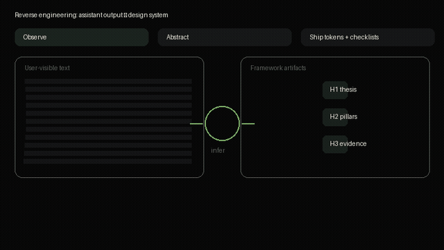

# Claude design — reverse engineering (community)

[](LICENSE)

```
  ___ _      _  _   _ ___  ___   ___  ___ ___ ___ ___ _  _
 / __| |    /_\| | | |   \| __| |   \| __/ __|_ _/ __| \| |
| (__| |__ / _ \ |_| | |) | _|  | |) | _|\__ \| | (_ | .` |
 \___|____/_/ \_\___/|___/|___| |___/|___|___/___\___|_|\_|
```

### Reverse engineered

This repo is an **unofficial, community-driven** project. It documents **observable patterns** in long-form assistant-style answers and the **information architecture** that makes them easy to scan: hierarchy, chunking, progressive disclosure, tables, and signposting — **not** proprietary model source. Explainer motion (960×540, Pillow + **ffmpeg**):



**What this is not**

- Not Anthropic or Claude **source code**, weights, or proprietary system prompts.
- Not a claim of **endorsement** by any vendor.
- Not a substitute for accessibility testing, user research, or your own brand guidelines.

**What this is**

- A **shared vocabulary** for builders (tokens, checklists, pattern cards).
- A place to align **public** marketing and documentation surfaces with a document-first reading rhythm.
- A home for **first-principles** notes: cognitive chunking, progressive disclosure, comparison tables, and recap blocks—patterns discussed widely in UX literature and visible in strong assistant outputs.

## Ethics and boundaries

Reverse engineering **assistant UX** here means improving our collective understanding of **layout and writing habits** that help humans read and act on long answers. Work only from **lawful, consensual, and public** material; respect vendor terms and people’s privacy; label uncertainty; and do not treat informal pattern lists as immutable “specs” for any product. The goal is **transparent analysis** so teams can ship **their own** surfaces responsibly.

## Repository layout

| Path | Purpose |
| --- | --- |
| `docs/` | Landing page (`index.html`), explainer media, framework notes, `CHECKLIST.md`. |
| `patterns/` | Community pattern write-ups (markdown). |
| `packages/tokens/` | Reusable CSS variables (`--cd-*`) for document-style sites. |
| `examples/` | Sanitized structural snippets. |
| `LICENSE` | MIT |
| `CONTRIBUTING.md` | Short contribution rules |

## Design tokens

`packages/tokens/tokens.css` defines `--cd-*` variables for dark “document UI” surfaces. Tokens are **brand-level** choices you apply in your own projects; they are **not** claimed to be extracted from any proprietary model UI.

## Quick start (tokens)

```html
<link rel="stylesheet" href="packages/tokens/tokens.css" />
```

Use the checklist in `docs/output-design-framework.md` when authoring long pages.

## Shipping status

- **License:** MIT (`LICENSE`).
- **Changelog:** [`CHANGELOG.md`](CHANGELOG.md).
- **Security:** [`SECURITY.md`](SECURITY.md) (docs-only repo).
- **Explainer animation:** `docs/media/framework-promo.{mp4,gif,png}` — regenerate with `scripts/render-framework-promo.py` (Pillow + ffmpeg; ASCII intro → subtitle → diagram; 256-color GIF + CRF 18 MP4).

## Deploy this site (GitHub Pages)

1. Repo **Settings → Pages → Build and deployment → Source: GitHub Actions**.
2. Push to `main`; workflow **Deploy docs site** publishes the `docs/` folder.
3. Public URL: `https://avasis-ai.github.io/claude-design-reverse-engineering/`

## Deploy (Vercel)

Import the repo, or use CLI: set **Root Directory** to `docs`, or keep repo root and use `vercel.json` (`outputDirectory: docs`). No install or build step is required.

## Contributing

See `CONTRIBUTING.md`.

## License

This project is licensed under the [MIT License](LICENSE).
